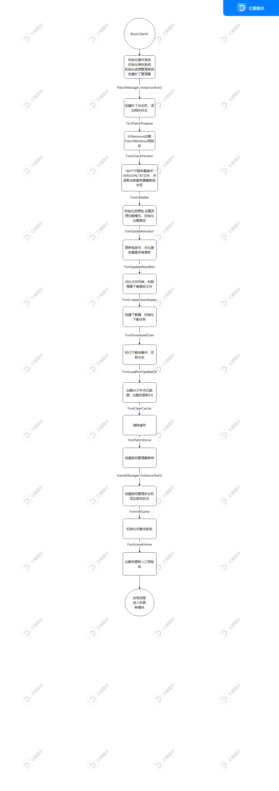
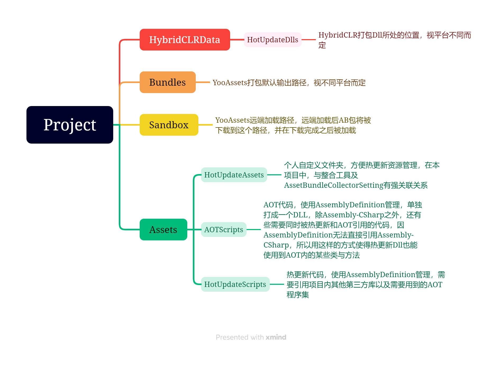
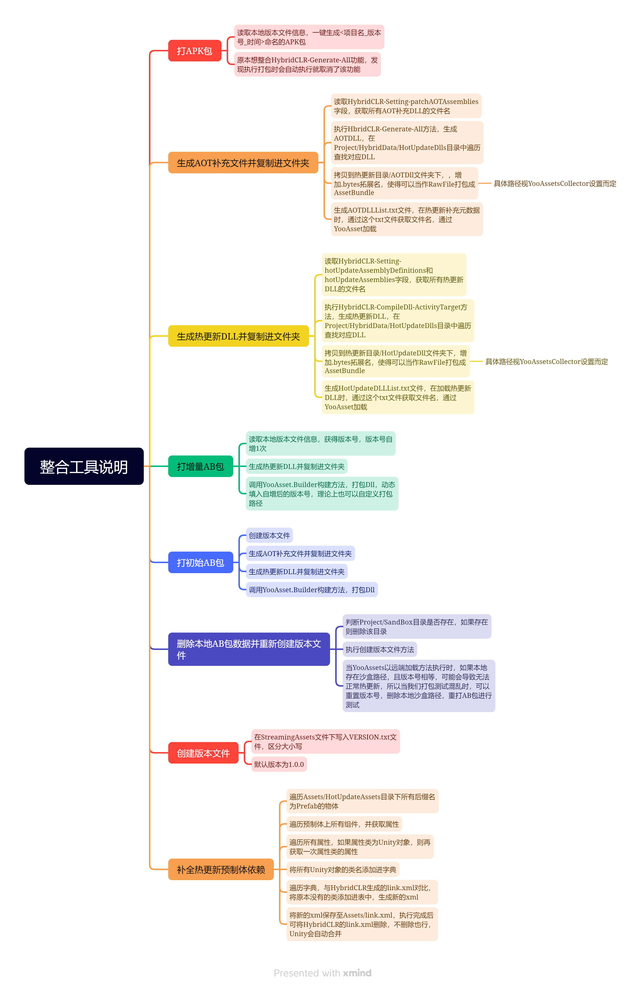
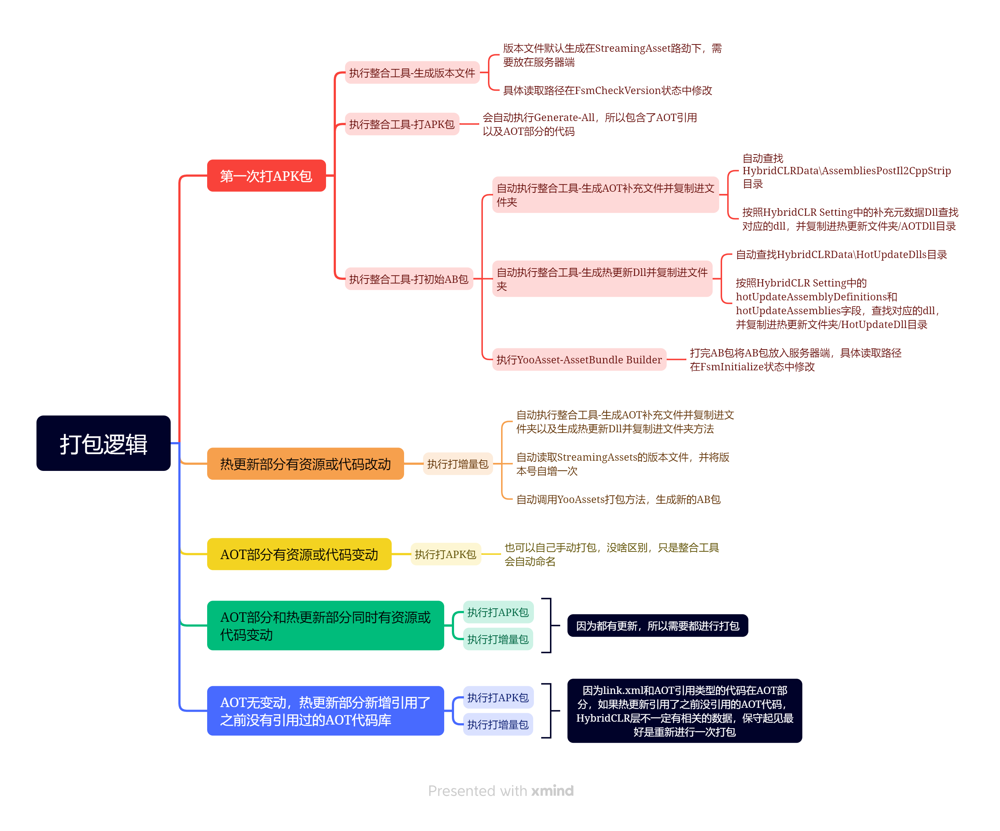

# HybridCLR+YooAsset+UniTask整合框架说明文档

## 首先需要明确的概念

### Assembly-CSharp.dll

Assembly-Csharp为Unity自动整合的dll，在Unity工程中任何没有被单独编译的代码都会被整合进这个Assembly-CSharp.dll中

### Assembly Definition

Assembly Definition是Unity2017.3以后出的一个功能，主要在于解决庞大的程序集编译时效问题

在Assets目录下任意一个文件夹创建一个Assembly Definition，会使得该文件夹下所有的代码单独编译成一个dll，并且修改该文件夹下代码时，只会重新编译该dll，而不会重新编译AssemblyCSharp.dll

当我们划分AOT程序集以及热更新程序集时，可以用到该功能

### AOT与热更新程序集的关系

#### AOT程序集

AOT程序集是随包一起打出，不会被更新的代码

在当前框架定义下，Assembly-CSharp为主AOT程序集，用AssemblyDefinition划分其他AOT

程序集

#### 热更新程序集

热更新程序集理论上可以是Assembly-CSharp程序集，但是为了保证项目逻辑清晰，资源管理方便，当前框架使用AssemblyDefinition划分单独的dll作为热更新程序集

### UniTask

UniTask是Github上的开源库，为Unity提供一个高性能异步方案，可以代替协程实现异步操作，同时兼容Unity生命周期，使得Awake，Start，协程等方法都可以异步执行，但是仍然运行在主线程上，C#的Task会运行在其他线程

### AOT补充元数据

因为某些程序集可能没有被AOT引用到而没有打包进包体内或没有被加载进内存中，导致热更新调用这些程序集时找不到相关类型，所以需要运行时主动去加载对应的dll，一般而言，使用第三方库都可能需要通过这种方法进行补充，经过测试，本项目中的YooAsset和NewtonJson，只需要正确设置热更新AssemblyDefinition引用，不需要通过AOT补充元数据即可调用，而UniTask需要补充后才可以调用

### 热更新Dll的加载

HybridCLR官方推荐直接代码直接挂载在预制体上，通过AssetBundle加载预制体的方法进行加载热更新，但是也可以通过AddComponent方法，从加载的热更新dll中直接反射出热更新入口类，挂载到这个物体上，以实现热更新,无论哪种方式,都需要在加载预制体或者加载类之前,提前加载好热更新的Dll

### HybridCLR打包流程

HybridCLR在每次出包时，需要编译热更新代码，执行CompileDll-ActivityTarget打包出DLL，修改后缀名后,作为RawFile打包成DLL进行加载

热更新DLL引用库发生变动，则需要重新执行Generate-All，获取依赖关系，生成Link,如果热更新引用了AOT部分没引用过的组件,则需要用整合工具生成link,也可以直接关闭代码裁剪

## 热更新运行流程



## 项目文件结构



## 整合工具说明

因为YooAssets和HybridCLR都是通过UnityPackageManager加载的，导致很多代码不够好用又无法修改，所以通过编辑器代码写了一套整合工具，使得两个第三方库可以配合的更好



## 打包流程



### 第一次打APK包

1在HTTPHepler脚本中确定配置好对应的IP地址，以用来访问对应的服务器

2.生成VERSION版本文件，并放入到可访问的服务器根目录（或自己在CheckVersion状态定义）

3.运行HybridCLR-Generate-All，生成AOT相关引用

4.打APK包

### 第一次打热更新包

1.在PublicData脚本中配置包名

2.运行整合工具-打初始AB包

### AOT部分代码改动

#### 需要通过注入元数据方式加载的第三方库更新

1.运行整合工具-生成AOT并复制进文件夹

2.执行整合工具-打增量AB包

该方法只支持第三方库只被热更新部分引用到，如果AOT部分也引用到该第三方库，也需要重新打APK包

#### AOT部分代码及资源改动

重新打APK

### 热更新部分代码及资源改动

1.执行整合工具-生成热更新dll并复制进文件夹

2.执行整合工具-打增量AB包


## 代码裁剪补充说明

### Unity的代码裁剪

Unity代码裁剪工具会分析项目中的程序集,查找和删除未使用的代码. 裁剪掉没有使用到的代码

### link.xml

Unity提供了一个方式来告诉Unity引擎，哪些类型是不能够被剪裁掉的。具体做法就是在Unity工程的Assets目录中建立一个叫link.xml的XML文件，然后按照下面的格式指定你需要保留的类型：

```
<linker>
  <assembly fullname="UnityEngine" preserve="all"/>
  <assembly fullname="Assembly-CSharp">
    <namespace fullname="MyGame.Utils" preserve="all"/>
    <type fullname="MyGame.SomeClass" preserve="all"/>
  </assembly>  
</linker>
```

### HybridCLR生成的link.xml

HybridCLR自带的生成工具可以自动引用热更新及AOT代码中的类，并添加到link.xml中，但是无法获取热更新预制体身上已挂在的，但没有在代码中显式调用的组件

例如：假设一个热更新的预制体上挂载了Animator组件，那么AnimationClip类会被裁剪掉，或者预制体挂载了Rigibody组件，那么PhysicsMaterial类会被裁剪掉，，并报出一个错误，提示你关闭代码裁剪

### 整合工具-补全热更新预制体依赖

该方法会遍历特定路径下，所有的后缀名为prefab的物体，并获取它们身上的组件，再从组件中获取属性，如果属性为Unity对象类型，则再获取一次属性，之所以需要再获取一次属性，是因为AnimationClip类在Animator中没有直接被引用，而是在RuntimeAnimator中引用，所以需要获取两层引用，具体获取几次，需要按照项目的需要进行改动

接着读取HybridCLR生成的link.xml，添加之前没有被添加过的程序集和类名

并存入Assets/link.xml路径，此时，项目中有两个link.xml,Assets路径下的link.xml包含了HybridCLR生成的类型，所以可以将原本的删除

如果不删除的话，Unity也会自动合并link.xml

通过该方法，可以补全部分预制体挂载组件没有被显式调用导致被裁剪的问题

### 代码裁剪补全方式的选择

代码裁剪补全大概有四种方式

1. 打包后查看报错，在Unity官方文档中查找对应的类型，再在热更新代码中显式调用对应类型，使用HybridCLR-Generate-link.xml来生成

这种方式对包体影响最小，可以达到最小化的包体，但是还是可能因为组件的引用问题，导致需要多次打包查看报错

2. 打包后查看报错，在Unity官方文档中查找对应的类型，再直接修改HybridCLR已生成的link.xml

这种方式基本等同与上个方式，但是不需要在代码中添加额外的引用，可以更简洁

3. 直接关闭代码裁剪，会导致包体大5M左右，这种方式最方便
4. 使用整合工具-补全热更新预制体依赖，这种方式可以在AOT更新前，人为的将所有没有被HybridCLR引用的组件和类添加到link.xml中，在我的测试中，包体大概大了400K左右，大概处于较方便，且对包体影响较小，还能保持代码的简洁，缺点就是可能会添加很多无用的类进link.xml中，且需要根据项目手动的修改方法

## 相关文档引用

### HybridCLR

https://hybridclr.doc.code-philosophy.com/#/README

### YooAsset

https://www.yooasset.com/docs/Introduce

### UniTask

https://github.com/Cysharp/UniTask/blob/master/README_CN.md